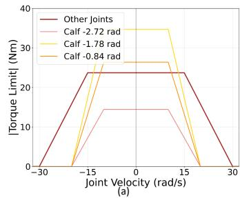
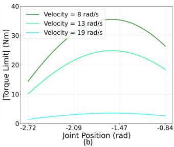
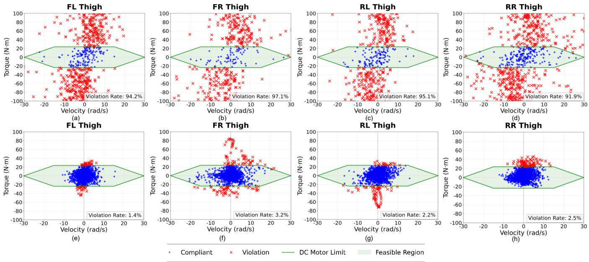
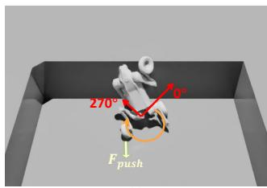
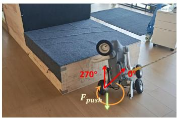
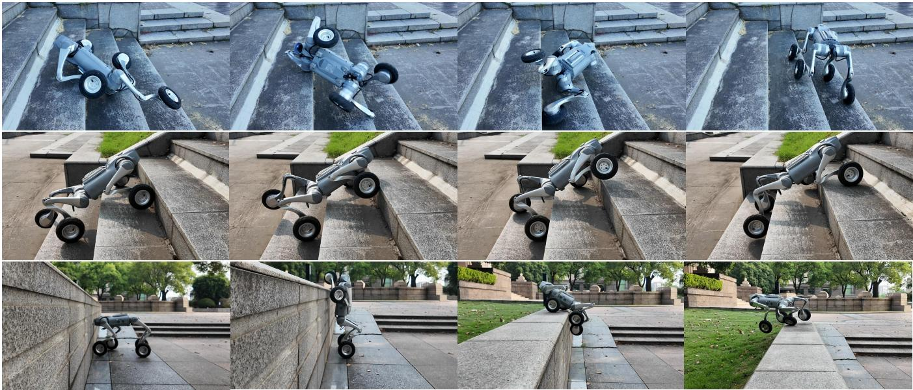

# MUJICA：面向轮腿机器人的多技能统一联合集成控制架构

Yuqi Li1, Peng Zhai1,∗, Yueqi Zhang1, Xiaoyi Wei1, Quancheng Qian1, Zhengxu He2, Qianxiang Yu2 and Lihua Zhang1,∗  
项目主页: https://hyzenthlayer.github.io/mujica/

**摘要** —— 轮腿机器人在穿越复杂地形方面具有潜力，相比纯腿足机器人具有更优越的机动性。然而，轮腿机器人必须有效平衡轮式驱动和腿足控制。此外，由于本体感知噪声和真实世界的电机约束，在电机峰值性能下实现鲁棒且自适应的运动控制仍然具有挑战性。我们提出了多技能统一联合集成控制架构（MUJICA），这是一个统一的、完全基于本体感知的轮腿机器人控制框架，将多种低层技能——包括全向运动、高台攀爬和跌倒恢复——集成于单一策略之中。所有技能通过唯一的指示变量加以区分，并在精确的直流电机约束建模下联合训练。此外，我们学习了一个高层技能选择器，仅基于本体感知动态选择最优技能，从而实现对周围环境的自适应响应。因此，MUJICA 增强了仿真到现实的鲁棒性，并实现了不同运动模式之间的无缝切换，促进了机器人在环境中的自主调整。我们在仿真和 Unitree Go2-W 机器人的真实世界实验中验证了该框架，结果表明在非结构化环境中，其适应性和任务成功率均取得了显著提升。

# I. 引言

随着硬件在电机扭矩和计算能力方面取得显著进步，腿足机器人在穿越具有挑战性的环境方面取得了令人瞩目的进展。它们适应不平坦地形和从扰动中恢复的能力使其适合执行现实世界中的任务，例如巡检和灾难响应[1]。尽管取得了这些进展，为腿足机器人设计控制算法仍然具有挑战性。控制器必须同时实现运动多样性、对不同地形的适应性以及在真实执行器约束下的安全部署。已有多种方法被提出，并在爬楼梯、斜坡穿越和扰动恢复等任务中展示了鲁棒性[2]–[6]。然而，由于机器人结构固有的局限性，腿足运动在平坦地面上的效率和速度往往有限，且缺乏穿越某些具有挑战性的地形（如高台）的能力。

1Yuqi Li, Yueqi Zhang, Xiaoyi Wei, Quancheng Qian, Peng Zhai, and Lihua Zhang 来自复旦大学智能机器人与先进制造学院，上海 200433，中国 {yuqili24, zhangyq23, weixy23, qcqian24}@m.fudan.edu.cn; {pzhai, lihuazhang}@fudan.edu.cn  
2Zhengxu He, and Qianxiang Yu 来自中国电建华东勘测设计研究院有限公司，杭州，中国 {he_zx, yu_qxl}@hdec.com  
∗ 通讯作者。

  
图 1: MUJICA 在轮腿机器人上的真实世界演示。顶行：连续运动中的自动技能切换。中行：三种代表性技能的执行，包括高台攀爬、爬楼梯和跌倒恢复。底行：机器人攀上 1 米高平台的快照。结果表明 MUJICA 具有执行多种技能并在无需外部感知的情况下无缝切换的能力。

轮腿机器人提供了一种有前景的替代方案，既结合了轮式的高效，又保留了腿足跨越障碍的能力。这种混合设计使得机器人能够在光滑表面上快速移动，同时保持处理崎岖地形和障碍物的能力[7]。然而，轮腿机器人在复杂真实环境中的全部潜力尚未被充分挖掘，因为大多数现有的轮腿机器人控制框架都是从腿足运动方法改编而来[7], [8]，因此也继承了这些方法的局限性。

我们认为当前腿足和轮腿运动方法存在三个关键局限性。第一，大多数仅基于本体感知的多技能盲控制器只能处理范围较窄的相似技能（运动多样性有限），例如在平坦或倾斜地形上行走，或者难度相对较低的技能，例如爬楼梯和爬坡[2]–[4], [9]。第二，对于处理具有不同动力学特征的异质技能，例如疾驰、缓行和爬行，控制器通常依赖手动切换[10], [11]。此外，这些方法主要旨在展示多技能学习范式，而非适应多样且复杂的地形。第三，为了确保在真实世界中安全部署，机器人关节的约束至关重要。在强化学习（RL）的背景下，这些物理限制通常被转化为动作惩罚或在优化问题中被纳入约束条件[12]–[14]。然而，大多数基于学习的方法采用简化的执行器约束，忽略了直流（DC）电机扭矩受速度和位置依赖的限制。像[15]这样的方法仅简单地对期望扭矩与实测扭矩之间的关系进行建模。缺乏精确的电机约束既限制了对电机性能的充分利用，也影响了仿真到现实迁移的安全性。因此，这些问题限制了轮腿运动在有挑战性地形上的表现和安全。

为了解决这些问题，我们提出了面向轮腿机器人的多技能统一联合集成控制架构（MUJICA），这是一个基于本体感知的控制框架，将多种运动技能——包括全向运动、高台攀爬和跌倒恢复——统一在单个网络之中。MUJICA 的核心特点在于其强调安全感知学习和可靠的仿真到现实迁移。我们显式地建模了电机速度与最大扭矩之间的关系，作为直流电机的硬约束，以防止部署过程中的不安全行为，并使机器人在执行高难度动作时能够更有效地利用其电机。此外，我们引入了一个高层选择器，利用本体感知反馈来自动化技能切换，从而在无需外部感知的情况下实现平滑且自适应的跨任务切换。

本文的主要贡献如下：

- 我们提出了一个统一的控制架构，将多种具有挑战性的技能——包括全向运动、高台攀爬和跌倒恢复——在单一盲策略中联合学习。
- 我们提出了一个基于直流电机硬约束的安全感知学习框架，以确保仿真到现实迁移的成功。
- 我们训练了一个高层技能选择器，基于本体感知和统一的速度跟踪奖励来实现自动化的技能切换。
- 我们通过广泛的仿真和在 Unitree Go2-W 机器人上的真实世界实验验证了 MUJICA 的有效性。

# II. 相关工作

## A. 基于学习的腿足机器人盲控制

由于针对轮腿运动的研究较少，且大多数方法类似于腿足控制，本节主要关注腿足运动。盲控制方法仅依赖本体感知反馈，例如关节状态和IMU数据，而不使用外部传感器。早期工作展示了端到端的深度强化学习策略用于四足机器人在平坦室内地面上的行走[16]。策略在仿真中训练，并在真实机器人上进行零样本部署。为了提高在非结构化地形上的性能，特权信息在策略训练中被广泛使用。RMA[17]利用自适应模块来模仿一个具有特权信息的基础策略，而DreamWaQ[4]通过一个具有特权观测的评论家来实现非对称演员-评论家架构，以更好地训练策略。另一条研究路线通过历史观测估计不可观测的状态，从而实现更好的地形适应。DreamWaQ[4]和HIM[18]都估计基座线速度和一个隐状态向量来增强运动的鲁棒性，FR-Net[5]预测机器人碰撞概率和质量分布以避免不必要的碰撞，使策略能够部署在不同的机器人上。然而，这些方法没有纳入捕获多种机器人特定信息的统一本体状态估计，限制了其在多技能策略部署中的适用性。

另一方面，在仿真中表现良好的策略并不一定保证安全的真实世界表现，这是由于环境和机器人动力学的差异。因此，在训练期间强制执行物理约束对于确保安全可靠的部署至关重要。约束强化学习的最新进展产生了若干创新方法来解决约束条件下策略优化的挑战。为了提高计算可处理性并简化奖励设计，一些方法将传统上受约束的策略迭代过程重新表述为等价的无约束优化问题[12], [13]。从另一个角度来看，CaT[19]巧妙地将硬约束重新解释为概率终止机制，在保持计算效率的同时实现了鲁棒的约束满足。然而，像 Dadiotis 等人[20]和 ALARM[21]这样仅通过最大允许值来约束关节扭矩的研究，忽略了直流电机在高速下最大扭矩输出会下降的事实，而[15]仅仅对期望扭矩与实测扭矩之间的关系进行建模。这一疏忽限制了机器人在极端工况下的安全性能。对于轮腿机器人，在轮腿协调中充分利用电机极限能力对于最大化性能至关重要，这进一步凸显了精确扭矩建模的必要性。

## B. 机器人中的多任务学习

机器人中多任务学习的目标是通过统一的策略让机器人完成不同任务或掌握多种技能。虽然[4], [18]使得机器人能够穿越楼梯和平坦地形，但这些技能的动作空间差异并不显著。因此，多任务框架需要能够处理差异较大的任务，使机器人能够学习不同的技能。现有框架主要分为两类：教师-学生策略蒸馏和分层强化学习。教师-学生策略蒸馏首先训练多个专家策略，每个策略专注于单一任务，然后使用监督学习训练一个学生策略来模仿这些专家[22], [23]。分层强化学习同样采用两阶段训练方案，首先训练多个低层单技能专家策略。对于高层策略，一些研究采用混合专家（MOE）框架来实现多技能学习，例如跌倒恢复、四足行走和双足行走，其中训练一个门控网络来计算这些专家的加权组合，产生一个融合了各种技能特征的混合策略[2], [24], [25]。相比之下，一些方法采用高层策略仅选择一个专家策略来执行。然而，蒸馏框架和MOE框架都无法解决低层行为之间的冲突（例如左右转弯时的冲突动作）[3], [9]。此外，依赖训练多个独立策略的方法通常增加了网络复杂性并降低了训练效率。其他方法利用模仿学习从多种参考运动中学习[11], [26]，但这些方法主要强调多技能学习范式，对适应多样且具有挑战性的地形关注有限。Chamorro 等人[8]专注于轮腿机器人爬楼梯，并在观测中加入了一个地形布尔变量来区分楼梯与其他地形。然而，这两项任务相对简单，无法充分发挥轮腿机器人的潜力，轮腿机器人的多技能学习挑战仍然未得到解决。

```mermaid
graph TD
    A["Constraint Critic"] --> B[" Reward Critic "]
    B --> C[" Command "]
    C --> D[" Multi-Task Environment "]
    D --> E[" Omnidirectional Moving "]
    D --> F[" High Platform Climbing "]
    D --> G[" Fall Recovery "]
    H[" Actor"] --> I[" PD Controller "]
    I --> J[" All Train & Deploy "]
    I --> K[" Only Training S1 "]
    I --> L[" Only Training S2 "]
    M[" Reference Encoder"] --> N[" GRU "]
    N --> O[" Online Encoder "]
    O --> P[" State Estimator "]
    P --> Q[" o_t+1 "]
    Q --> R[" o_t "]
    R --> S[" o_t-H:t "]
    S --> T[" o_t-H:t "]
    T --> U[" o_t "]
    U --> V[" o_t "]
    V --> W[" o_t "]
    W --> X[" o_t "]
    X --> Y[" o_t "]
    Y --> Z[" o_t "]
    Z --> AA[" o_t "]
    AA --> AB[" o_t "]
    AB --> AC[" o_t "]
    AC --> AD[" o_t "]
    AD --> AE[" o_t "]
    AE --> AF[" o_t "]
    AF --> AG[" o_t "]
    AG --> AH[" o_t "]
    AH --> AI[" o_t "]
    AI --> AJ[" o_t "]
    AJ --> AK[" o_t "]
    AK --> AL[" o_t "]
    AL --> AM[" o_t "]
    AM --> AN[" o_t "]
    AN --> AO[" o_t "]
    AO --> AP[" o_t "]
    AP --> AQ[" o_t "]
    AQ --> AR[" o_t "]
    AR --> AS[" o_t "]
    AS --> AT[" o_t "]
    AT --> AU[" o_t "]
    AU --> AV[" o_t "]
    AV --> AW[" o_t "]
    AW --> AX[" o_t "]
    AX --> AY[" o_t "]
    AY --> AZ[" o_t "]
    AZ --> BA[" o_t "]
    BA --> BB[" o_t "]
    BB --> BC[" o_t "]
    BC --> BD[" o_t "]
    BD --> BE[" o_t "]
    BE --> BF[" o_t "]
    BF --> BG[" o_t "]
    BG --> BH[" o_t "]
    BH --> BI[" o_t "]
    BI --> BJ[" o_t "]
    BJ --> BK[" o_t "]
    BK --> BL[" o_t "]
    BL --> BM[" o_t "]
    BM --> BN[" o_t "]
    BN --> BO[" o_t "]
    BO --> BP[" o_t "]
    BP --> BQ[" o_t "]
    BQ --> BR[" o_t "]
    BR --> BS[" o_t "]
    BS --> BT[" o_t "]
    BT --> BU[" o_t "]
    BU --> BV[" o_t "]
    BV --> BW[" o_t "]
    BW --> BX[" o_t "]
    BX --> BY[" o_t "]
    BY --> BZ[" o_t "]
```

flowchart

| 符号 | 含义 |
|------|------|
| $o_t/o_t^{priv}$ | 观测 |
| $\omega_t^b\in\mathbb{R}^3$ | 基座角速度 |
| $g_t^b\in\mathbb{R}^3$ | 基座投影重力 |
| $cmd_t\in\mathbb{R}^3$ | 指令 |
| $q_t\in\mathbb{R}^{16}$ | 关节位置 |
| $\dot{q}_t\in\mathbb{R}^{16}$ | 关节速度 |
| $a_{t-1}\in\mathbb{R}^{16}$ | 上一动作 |
| $\zeta_t\in\mathbb{R}$ | 技能类型 |
| $v_t\in\mathbb{R}^3$ | 基座线速度 |
| $c_t\in\mathbb{R}^{18}$ | 碰撞状态 |
| $u_t\in\mathbb{R}^4$ | 轮-地距离 |
| $h_t\in\mathbb{R}^{187}$ | 局部高程图 |

图 2: MUJICA 框架总览。每个任务关联一个唯一的技能指示器。在训练阶段 S1 中，状态估计器学习从本体感知中预测隐状态向量、基座线速度、轮-地距离和机器人部件碰撞状态。演员网络随后以估计结果和当前观测作为输入并生成动作。奖励评论家和约束评论家通过特权观测评估状态价值和约束违反。在训练阶段 S2 中应用技能选择器来学习技能切换，努力适应不同的地形和状态。

# III. 问题建模

## A. C-POMDP 框架

轮腿机器人在非结构化环境中运行，由于传感器噪声，完全的状态可观测性往往是不可行的。同时，必须满足安全关键约束（例如接触力、电机限制）以确保在真实世界中的可靠部署。因此，我们将问题建模为一个约束部分可观测马尔可夫决策过程（C-POMDP），力求找到一个最大化长期回报同时满足所有约束的策略 $\pi ^ { * }$：

$$
\max \mathbb {E} _ {\pi} \left[ \sum_ {t = 0} ^ {\infty} \gamma^ {t} R \left(\boldsymbol {s} _ {t}, \boldsymbol {a} _ {t}, \boldsymbol {s} _ {t + 1}\right) \right] \tag {1}
$$

$$
\mathrm{s.t.} \mathbb {E} _ {\pi} \left[ \sum_ {t = 0} ^ {\infty} \gamma^ {t} C _ {i} \left(\boldsymbol {s} _ {t}, \boldsymbol {a} _ {t}, \boldsymbol {s} _ {t + 1}\right) \right] \leq \delta_ {i}, \forall i \in \{1, \dots , k \}
$$

其中 $R$ 代表奖励，$C _ { i }$ 表示第 $i$ 个约束，对应的限制为 $\delta _ { i }$，具体将在第 IV-C 节中详细说明。

## B. 观测空间与状态空间

由于所提出的框架是为盲策略设计的，策略的条件输入仅包含本体感知的观测空间。同时，我们将状态空间定义为特权观测空间，包括与任务相关且具有物理信息量的量，评论家网络从中接收输入（详见第 IV-B 节）。因此，在时刻 $t$ 的观测和特权观测定义为：

$$
\boldsymbol {o} _ {t} = \left[ \boldsymbol {\omega} _ {t} ^ {b}, \boldsymbol {g} _ {t} ^ {b}, \boldsymbol {c m d} _ {t}, \boldsymbol {q} _ {t}, \dot {\boldsymbol {q}} _ {t}, \boldsymbol {a} _ {t}, \zeta_ {t} \right] ^ {T} \tag {2}
$$

$$
\boldsymbol {s} _ {t} \triangleq \boldsymbol {o} _ {t} ^ {\text { priv }} = [ \boldsymbol {o} _ {t}, \boldsymbol {v} _ {t}, \boldsymbol {c} _ {t}, \boldsymbol {u} _ {t}, \boldsymbol {h} _ {t} ] ^ {T} \tag {3}
$$

## C. 动作空间

动作空间定义为所有关节电机的控制指令。对于每个腿关节，动作对应于相对于预定义默认姿态的角度偏移量，而对于轮关节，动作指定期望的电机速度。在每个时间步，策略输出一个动作向量 $\mathbf { \delta } _ { \mathbf { \alpha } \mathbf { \delta } \mathbf { a } _ { t } }$，然后通过 PD 控制器转化为电机扭矩：

$$
\tau_ {t} ^ {i} = \left\{ \begin{array}{l l} K _ {d} ^ {i} \left(\dot {q} _ {t} ^ {i} - a _ {t} ^ {i}\right), & \text { if   } i = \text { wheel } \\ K _ {p} ^ {i} \left(q _ {t} ^ {i} - a _ {t} ^ {i}\right) - K _ {d} ^ {i} \dot {q} _ {t} ^ {i}, & \text { otherwise } \end{array} \right. \tag {4}
$$

其中 $\tau _ { t } ^ { i }$ 是第 $i$ 个电机的目标扭矩输出，$K _ { p } ^ { i }$ 和 $K _ { d } ^ { i }$ 分别表示刚度和阻尼。

# IV. 方法

在本节中，我们将详细介绍所提出的 MUJICA 框架的方法论。整体架构如图 2 所示。

## A. 状态估计器

仅依赖本体感知，机器人无法直接获取对技能执行至关重要的地形几何或接触条件。因此，为了推断周围环境，受 HIM[18]（构建内部模型以预测系统对扰动的响应）的启发，我们基于过去观测的缓冲区开发了一个状态估计器。为了捕捉时间依赖性，该估计器利用一个在线编码器，通过基于 GRU 的网络处理过去 $H =$ 6 帧的观测。除了估计隐状态向量 $\scriptstyle { \hat { e } } _ { t }$ 和机器人基座线速度 $\hat { \pmb { v } } _ { t }$ 之外，我们还预测每个机器人组件的碰撞概率 $\hat { \ b { c } } _ { t }$ 和轮-地距离 $\hat { \mathbf { \mathscr { u } } } _ { t }$。显式预测速度有助于机器人理解运动动力学，区分稳定和不稳定的运动状态。轮-地距离估计反映了地形粗糙度，使机器人能够抑制平坦地面上的不必要抬腿动作，并更好地协调轮-腿交互。推断碰撞概率有助于机器人检测与障碍物的接触，例如利用头部碰撞感知即将到的平台边缘以进行攀爬，并实现地形自适应恢复行为。

估计过程可以表述如下：

$$
\boldsymbol {f} _ {t} = \mathrm{GRU} \left(\mathrm{NN} \left(\boldsymbol {o} _ {t - H: t}\right), \boldsymbol {f} _ {t - 1}\right) \tag {5}
$$

其中 $\begin{array} { r c l } { \pmb { f } _ { t } } & { = } & { [ \hat { \pmb { v } } _ { t } , \hat { \pmb { c } } _ { t } , \hat { \pmb { u } } _ { t } , \hat { \pmb { e } } _ { t } ] ^ { T } } \end{array}$，NN 表示全连接层。

为了有效训练在线编码器，我们引入了一个参考编码器，将后继观测 $\mathbf { \sigma } _ { o _ { t + 1 } }$ 映射到一个隐状态 $e _ { t }$ 作为监督目标，并应用对比学习损失。

综上所述，估计器损失可以表述为：

$$
\mathcal {L} ^ {\text { Estimate }} = \mathcal {L} ^ {\text { Pred }} + \mathcal {L} ^ {\text { SwAV }} (\boldsymbol {e} _ {t}, \hat {\boldsymbol {e}} _ {t}) \tag {6}
$$

$$
\mathcal {L} ^ {\text { Pred }} = \mathcal {L} _ {\text { MSE }} (\boldsymbol {v} _ {t}, \hat {\boldsymbol {v}} _ {t}) + \mathcal {L} _ {\text { BCE }} (\boldsymbol {c} _ {t}, \hat {\boldsymbol {c}} _ {t}) + \mathcal {L} _ {\text { MSE }} (\boldsymbol {u} _ {t}, \hat {\boldsymbol {u}} _ {t}) \tag {7}
$$

其中 $\mathcal { L } _ { \mathrm { M S E } }$ 为均方误差损失，$\mathcal { L } _ { \mathrm { B C E } }$ 为二元交叉熵损失，SwAV 是遵循[27]的对比学习损失。

## B. 非对称演员-评论家框架

如第 III-B 节所述，轮腿机器人在部署期间处于部分可观测状态，但需要基于不可观测的地形特性进行安全性评估。同时，接触到完整状态信息的评论家能够更快地学习价值函数，更好地指导演员网络的学习[28]。因此，MUJICA 提出了一种非对称演员-评论家框架。策略网络 $\pi _ { \theta }$ 接收来自在线编码器的历史嵌入观测 $\pmb { f } _ { t }$ 和当前观测 $\mathbf { } _ { o _ { t } }$ 作为输入。

同时，为求解公式(1)中的约束优化问题，我们采用了 P3O[12] 框架，该框架使用一个奖励评论家和一个约束评论家。两个评论家都以特权观测 $o _ { t } ^ { p r i v }$ 为条件，分别评估状态价值和约束违反。

P3O 通过一种基于惩罚的迭代方法，将约束优化问题转化为无约束目标。因此，P3O 损失可以表述为：

$$
\mathcal {L} ^ {\mathrm{P3O}} (\theta) = \mathcal {L} _ {R} ^ {\mathrm{CLIP}} (\theta) + \kappa \sum_ {i = 1} ^ {k} \max \{0, \mathcal {L} _ {C _ {i}} ^ {\mathrm{CLIP}} (\theta) \} \tag {8}
$$

$$
\mathcal {L} _ {R} ^ {\mathrm{CLIP}} (\theta) = \underset { \begin{array}{c} s \sim d ^ {\pi} \\ a \sim \pi \end{array} } {\mathbb {E}} [ - \min \{r (\theta) A _ {R} ^ {\pi} (s, a), \tag {9}
$$

$$
\left. \operatorname{clip} (r (\theta), 1 - \epsilon , 1 + \epsilon) A _ {R} ^ {\pi} (s, a) \right\}
$$

$$
\mathcal {L} _ {C _ {i}} ^ {\mathrm{CLIP}} (\theta) = \underset { \begin{array}{c} s \sim d ^ {\pi} \\ a \sim \pi \end{array} } {\mathbb {E}} \left[ \max \left\{r (\theta) A _ {C _ {i}} ^ {\pi} (s, a), \operatorname{clip} (r (\theta), \right. \right. \tag {10}
$$

$$
\left. \left. 1 - \epsilon , 1 + \epsilon) A _ {C _ {i}} ^ {\pi} (s, a) \right\} + (1 - \gamma) \left(J _ {C _ {i}} (\pi) - \delta_ {i}\right) \right]
$$

其中 $r ( \theta )$ 是新旧策略之间的重要性采样比，$A _ { R } ^ { \pi }$ 和 $A _ { C _ { i } } ^ { \pi }$ 分别是奖励和第 $i$ 个约束的优势函数，$d ^ { \pi } ( s )$ 是折扣未来状态分布，$\kappa$ 是惩罚因子。${ \mathcal { L } } _ { R } ^ { \mathrm { C L I P } }$ 是经过裁剪的 PPO 替代目标[29]，确保稳定的奖励驱动更新，而 $\mathcal { L } _ { C _ { i } } ^ { \mathrm { { { C L I P } } } }$ 编码了特定于约束的损失并进行裁剪以防止过于激进的更新。$\left( J _ { C _ { i } } ( \pi ) - \delta _ { i } \right)$ 对超过 $\delta _ { i }$ 的期望约束代价进行惩罚，乘以 $( 1 - \gamma )$ 进行缩放。对所有约束求和，P3O 目标在最大化奖励的同时抑制不安全行为，产生既高性能又安全的策略。为使机器人能够逐步掌握更高难度的技能，我们设计了课程学习方案来训练演员-评论家网络（详见第 V-A 节）。

line

| Joint Velocity (rad/s) | Other Joints | Calf -2.72 rad | Calf -1.78 rad | Calf -0.84 rad |
| ---------------------- | ------------ | -------------- | -------------- | -------------- |
| -30                    | 0            | 0              | 0              | 0              |
| -15                    | 25           | 15             | 35             | 25             |
| 0                      | 25           | 15             | 35             | 25             |
| 15                     | 25           | 15             | 35             | 25             |
| 30                     | 0            | 0              | 0              | 0              |

line

| Joint Position (rad) | Velocity = 8 rad/s | Velocity = 13 rad/s | Velocity = 19 rad/s |
| ------------------- | ------------------ | ------------------- | ------------------- |
| -2.72               | 15                 | 10                  | 1                   |
| -2.09               | 30                 | 20                  | 2                   |
| -1.47               | 35                 | 25                  | 3                   |
| -0.84               | 25                 | 18                  | 2                   |

图 3: (a) 所有关节的依赖速度的扭矩限制。小腿关节的限制还受关节位置影响。(b) 小腿关节的基于位置的扭矩限制。

## C. 多任务奖励与约束

为了在单一策略中学习多种技能，我们提出了技能指示器 $\zeta _ { t }$。每个技能关联一个唯一的指示变量，使得各个技能的观测空间在这一特定维度上解耦。因此，通过技能指示器 $\zeta _ { t }$，我们提出的架构可以扩展到各种轮腿任务。在本研究中，我们设计了三个具有代表性且具有挑战性的任务：(i) 在普通地形上的全向运动，(ii) 高台攀爬，以及 (iii) 跌倒恢复。全向运动技能需要跟踪线速度和角速度，而高台攀爬技能只需要跟踪线速度。对于跌倒恢复，机器人需要学习从任意姿态翻转自身。

  
图 4: 不同算法在各代表性任务所有难度级别上的成功率。

表 I: MUJICA 的主要奖励与约束

|      |      |      |
| ---- | ---- | ---- |
|      |      |      |
|      |      |      |
|      |      |      |

| 奖励 $R_t$ 或约束 $C_t$ | 公式 | 适用任务 |
|--------------------------|------|----------|
| $R_{cmd_v,t}$ | $\exp\left(-\| \boldsymbol{cmd}_{xy,t}-\boldsymbol{v}_{xy,t}\|^2/\sigma^2\right)$ | i,ii |
| $R_{cmd_\omega,t}$ | $\exp\left(-\| \boldsymbol{cmd}_\omega,t-\omega_z,t\|^2/\sigma^2\right)$ | i |
| $R_{gravity,t}$ | $\exp\left(-\angle\left(\boldsymbol{g}_t^b,\boldsymbol{g}^{world}\right)/\sigma^2\right)$ | iii |
| $R_{poserr,t}$ | $\exp\left(-\| \boldsymbol{q}-\boldsymbol{q}_{stand}\|^2\right)/\sigma^2)$ 若 $|\angle\left(\boldsymbol{g}_t^b,\boldsymbol{g}^{world}\right)|< \epsilon$ | iii |
| $C_{DC-motor,t}$ | $\sum_{i=1}^{16} 1_{|\tau_t^i| \geq \tau_{limit}^i}$ | i,ii,iii |
| $C_{collision,t}$ | $\sum_i c_t^i, i = \text{thigh,calf}$ | i,ii |

主要的与任务相关的奖励和约束列于表 I 中，其余部分在视频中补充说明。值得注意的是，对大腿和小腿施加了碰撞约束，以鼓励机器人使用轮子而非腿部与环境交互。此外，为了考虑电机的物理限制，我们为所有任务引入了直流电机约束。具体而言，受[30]中电机工作区域的启发，如图 3 所示，每个执行器受到依赖速度的扭矩限制，其中在低速时最大扭矩保持恒定，而在高速时随速度增大线性下降。小腿关节连接大腿与小腿连杆，因此扭矩同时受关节速度和关节位置的影响，在固定速度下最大扭矩呈现与关节位置的余弦依赖关系，而其他关节电机仅受关节速度影响。具体数值来自 Unitree 官方电机手册。

## D. 技能选择器

在训练了若干鲁棒的运动技能之后（训练阶段 S1），为了使机器人能够在不同地形上做出自适应行为，我们采用了一个基于本体感知的高层技能选择器来自动化地激活低层运动策略，即自动选择合适的 $\zeta _ { t }$。具体来说，高层选择器以最后 $H$ 帧观测 $\begin{array} { r l } { \mathbf { { \cal O } } \mathbf { { \cal t } } - \mathbf { { \cal H } } : \mathbf { { \cal t } } : } & { { } } \end{array}$（不包括 $\zeta _ { t }$）作为输入，输出在预定义运动技能集合上的概率分布。我们实现了一个非对称演员-评论家网络，在冻结的技能策略之上通过统一的速度跟踪奖励来训练技能选择器（训练阶段 S2）。这种分层设计简化了低层学习，并通过灵活的技能组合提高了泛化能力。

# V. 实验

我们在多种地形上训练 MUJICA，并在仿真和真实世界中进行了广泛的实验，以验证其有效性和峰值性能。具体而言，以下实验旨在回答：

- MUJICA 能否有效完成多种任务，其性能与基线方法和消融变体相比如何？（第 V-B 节）
- 所提出的技能选择器能否在特性差异较大的任务之间实现可靠切换，从而提高顺序任务的成功率？（第 V-C 节）
- MUJICA 策略能否迁移到真实的轮腿机器人上，展示零样本仿真到现实的表现？（第 V-D 节）

## A. 训练

### 1) 设置
仿真中的所有实验均在 IsaacLab 平台上进行，使用单块 NVIDIA RTX 4090 GPU，配备 4,096 个并行环境。我们选择图 2 所示的 Unitree Go2-W 来验证所提出的架构。低层控制器和高层选择器均以 50 Hz 的频率工作，而物理仿真以 200 Hz 的频率执行。低层训练过程进行 30,000 次迭代，高层训练进行 10,000 次迭代。在跌倒恢复任务中，每个 episode 持续 6 秒，包括 2 秒从空中以随机姿态自由落体和 4 秒恢复时间，在此期间任务不会终止。对于其他任务，每个 episode 持续 20 秒，当基座发生碰撞时终止。

### 2) 课程学习
为了使机器人能够逐步探索适应具有挑战性地形的运动，遵循[31]，我们应用了课程学习框架。

我们构建了一个 $3 \times 20$ 的网格状多任务环境，其中 4,096 个机器人被分配到不同的行，每行对应一个特定的地形及其相应的任务，而每列代表一个课程难度级别。

在训练阶段 S1 期间，我们根据分配给每个机器人的任务显式地设置正确的技能指示器。对于全向运动和跌倒恢复，地形设置为楼梯、斜坡、离散化地形和崎岖地形。对于高台攀爬，地形设置为一个位于地面上的大型凹陷，要求机器人从中爬出，允许向任意方向攀爬。考虑到这三种技能的目标，对于全向运动和高台攀爬，一旦机器人成功维持速度跟踪一段时间，课程就会推进，如果机器人的行进距离远低于理论距离，课程就会后退。对于跌倒恢复，当机器人处于标准站立姿态的一定范围内时课程推进，否则后退。相应地形的参数如下，地形级别 $l \in [1, 20]$：

- 楼梯：台阶宽度 0.3 m，台阶高度 $0.05 + 0.18 \times l / 20$ m；
- 斜坡：坡度 $0.5 \times l / 20 \times 100\%$；
- 离散化地形：地面上有 30 个矩形凸起，宽度范围为 1 m 到 2 m，高度为 $0.05 + 0.17 \times l / 20$ m；
- 崎岖地形：高度从 $[0.04, 0.12]$ m 均匀采样；
- 凹陷：地面上的矩形坑，尺寸为 2 m × 4 m（长 × 宽），深度为 $0.05 + l / 20$ m。

在训练阶段 S2 期间，所有环境被同等对待，期望机器人能够自主选择技能以持续跟踪速度指令。

表 II: 仿真参数随机化

| 参数 | 随机化范围 |
|------|-----------|
| 静摩擦 | [0.6, 1.0] |
| 动摩擦 | [0.4, 0.8] |
| 基座质量偏差 | [-1.0, 3.0] kg |
| 外部力 | 每 2-3 s 施加 [-10.0, 10.0] N |
| 推撞机器人 | 每 8-12 s 在 x 或 y 方向以 [-1.0, 1.0] m/s 推动 |
| 电机增益乘数 | [0.8, 1.2] |

### 3) 域随机化
为提高所提方法的鲁棒性并确保仿真到现实迁移的顺利进行，我们在训练过程中广泛实施了域随机化。表 II 列出了随机化的变量及其均匀采样范围。

## B. 对比与消融实验

### 1) 基线对比与状态估计器消融
我们首先将我们的方法与以下若干基线和消融变体在各项技能的性能上进行比较：

- MUJICA（我们的方法）：使用所有模块进行训练。
- MUJICA w/o Velocity：训练时不包含基座线速度估计。
- MUJICA w/o Wheel Height：训练时不包含轮-地距离估计。
- MUJICA w/o Collision：训练时不包含机器人部件碰撞估计。
- DreamWaQ[4] + P3O[12]：一个在约束条件下训练的框架，显式估计基座线速度并通过上下文辅助 VAE 估计器网络隐式推断特权状态。
- Vanilla PPO[29]：仅使用本体感知进行训练。

上述所有方法均在相同的地形课程和奖励函数下训练。为评估策略的有效性和鲁棒性，选择了 5 个代表性任务，并设计了 10 个递增的难度级别，级别间距相比训练加倍。全向运动的成功标准是维持 1 m/s 的目标速度 20 秒；跌倒恢复的成功标准是在 4 秒内达到与标称姿态相似的稳定站立姿态；高台攀爬的成功标准是在 3 秒内攀上台并在其上保持稳定。所有方法使用 4 个随机种子进行测试，报告平均成功率及标准差。

结果如图 4 所示。首先，除 vanilla PPO 外，所有方法在所有难度级别的斜坡上都能成功恢复，这是因为滚动使得机器人能够利用光滑斜坡表面的外力。在总体性能方面，我们使用了基座速度、轮-地距离和碰撞估计的 MUJICA 框架在所有任务上一致地优于所有基线和消融变体。值得注意的是，在更高的难度级别上性能差距显著扩大，证明了我们所提架构在增强鲁棒性方面的有效性。消融结果表明，移除三个估计组件中的任何一个都会导致性能明显下降，说明对环境进行准确评估需要三个元素的联合预测。此外，对于非恢复任务，省略速度估计尤其有害，这凸显了其对适应动态环境的重要性。

与同样采用约束条件下估计框架的 DreamWaQ[4] + P3O[12] 相比，我们的方法表现出更优越的性能。这表明我们特定的估计目标和网络架构选择更有效地捕获了轮腿机器人执行多种任务所需的信息。需要注意的是，由于轮腿机器人具有卓越的机动性，即使使用最简单的 PPO 基线算法训练的策略也能成功完成斜坡穿越任务。然而，由于缺乏状态估计，PPO 未能学会任何跌倒恢复技能。

### 2) 直流电机约束消融
为进一步研究直流电机约束的作用，我们分析了仿真中不同地形下大腿关节的扭矩-速度分布。如图 5 所示，在无约束情况下（图 5a-d），关节表现出严重的违反行为，超过 90% 的样本位于电机可行区域之外。为清晰起见，图中截断至 ±100 N·m，尽管存在许多幅值更大的离群点。此外，在没有直流电机约束的情况下，关节经历了持续振荡，且在高台攀爬期间，后大腿关节频繁触及正向关节极限。在此极限下，推压地面时会产生大力矩，直接触发真实机器人的电机故障（如图 6 所示）。相比之下，在施加直流电机约束的情况下（图 5e-h），我们的方法有效地将分布保持在可行区域内，将违反率降低到 3.5% 以下，并确保了稳定、可供硬件执行的关节行为。值得注意的是，在零速度处的密集点簇主要源于机器人从坑外跳入坑内时产生的冲击，对大腿关节施加了大的冲量。

图 5: 各地形下大腿关节的扭矩-速度分布。绿色区域表示符合直流电机约束。蓝色点为绿色区域内的电机状态，红色叉号则表示超出范围。(a)–(d) 显示无直流电机约束的结果，(e)–(h) 显示约束后的结果。

text_image

270°
90°
F push

text_image

270°
F push

图 6: 无直流电机约束的高台攀爬。后大腿关节处于关节极限并会产生大力矩以跳得更高。(a) 仿真中 (b) 真实世界中。

表 III: 顺序地形上的分阶段成功率

| 方法 | 楼梯恢复 | 爬楼梯 | 高台攀爬 |
|------|---------|--------|----------|
| w/o indicator（共享奖励） | ✕ | ✕ | ✕ |
| w/o indicator（分离奖励） | 72% | 72% | 38% |
| with skill selector（我们的方法） | 95% | 95% | 91% |

## C. 技能选择器评估

为验证高层技能选择器是否能够自主切换技能以处理复杂环境，我们在一个 episode 中评估了三个变体，该 episode 按顺序链接了三个中等难度（即 10 级中的第 5 级）的任务：(i) 楼梯恢复，(ii) 爬楼梯，和 (iii) 高台攀爬。每次运行必须按顺序完成所有三个任务才算成功。我们在相同地形和手动给定指令下进行了 100 个 episode 的测试。失败定义为爬楼梯或高台攀爬期间发生基座碰撞，或在调整指令后 3 秒内无法完成目标任务。

我们将我们的方法与以下两个基线进行比较：

- w/o indicator（共享奖励）：训练时不使用技能指示器，所有任务使用统一奖励。
- w/o indicator（分离奖励）：训练时不使用技能指示器，不同任务使用不同的奖励项。

结果如表 III 所示。没有技能指示器的策略可能会在不同任务间混淆行为，从而削弱单任务性能。特别是，统一奖励训练方案往往会崩溃（即无法学会技能），而分离奖励方案在中等难度任务上相比所提出的分层控制架构仍然产生了较低的成功率。这突出表明，仅靠奖励工程不足以实现多技能集成。没有显式的指示器，策略难以解耦特定于任务的策略并跨异质目标进行泛化。相比之下，引入技能指示器和高层技能选择器能够实现清晰的任务区分，稳定训练过程，并最终在复杂场景中支持可靠的顺序执行。

## D. 真实世界实验

为验证 MUJICA 的零样本仿真到现实性能，我们在真实世界的 Unitree Go2-W 机器人上部署了策略。所有机载计算均在 NVIDIA Jetson Orin NX 上执行。这些实验旨在评估各项技能的鲁棒性以及技能选择器在自主多技能执行中的有效性。

### 1) 单项技能验证
我们首先在普通和具有挑战性的条件下评估各项技能。在楼梯恢复中（图 7 顶行），机器人在 30° 的楼梯上成功从倒置状态恢复，利用小腿击打产生扭矩并旋转基座，展示了在随机关节位置下不平坦地形上的鲁棒性。在爬楼梯中（图 7 中行），机器人稳定地爬上具有不同台阶高度和不规则边缘的楼梯。对于高台攀爬，机器人攀上了 80 cm 高的室外平台（图 7 底行），并在室内实现了具有挑战性的 1 m 高平台攀爬（图 1 底行），接近其机械和驱动极限。该动作需要蹲下后大腿关节以储存能量，伸展前腿勾住箱子，并协调抬起后腿，展示了完整的轮-腿协同。据我们所知，此前没有工作使轮腿机器人能够完成这一极限任务。在所有任务中，电机保护机制——在电流过大或过热时触发——始终未激活，表明该算法充分发挥了轮腿运动的全部潜力。

natural_image

Sequence of photos showing a robotic car on stone steps, captured in various angles and motion poses (no text or symbols visible)

图 7: 单项技能的真实世界评估。顶行：楼梯上的跌倒恢复。中行：爬上 20 cm 高的楼梯。底行：攀上 80 cm 高的平台。

### 2) 多技能切换测试
我们随后评估了 MUJICA 在连续真实世界任务中自主集成多种技能的能力（图 1 顶行）。在一次演示中，机器人从随机跌倒姿态开始，执行恢复，爬上楼梯和斜坡，最后攀上一个 60 cm 高的平台。高层技能选择器基于本体感知无缝切换策略，无需人工干预：检测到跌倒姿态触发恢复，恢复直立姿态后切换到全向运动，遇到箱子则激活高台攀爬技能。真实世界实验的完整演示可在补充视频中观看。

# VI. 结论

在本文中，我们提出了 MUJICA，一个统一的控制架构，使轮腿机器人能够在单一本体感知策略中习得并集成多种具有挑战性的运动技能。通过引入技能选择器和带有精确直流电机约束的安全感知学习框架，MUJICA 实现了跨多种任务（如全向运动、高台攀爬和跌倒恢复）的平滑切换。广泛的实验表明，所提出的方法不仅相比基线和消融变体提高了鲁棒性，还实现了可靠的零样本仿真到现实迁移。这些结果彰显了 MUJICA 在提升复杂真实环境中轮腿机器人的自主性和适应性方面的潜力。未来的工作将探索将该框架扩展到更广泛的运动技能集，并在非结构化地形上实现自适应协调。

# 参考文献

[1] C. Tang, B. Abbatematteo, J. Hu, R. Chandra, R. Mart´ın-Mart´ın, and P. Stone, "Deep reinforcement learning for robotics: A survey of realworld successes," in *Proceedings of the AAAI Conference on Artificial Intelligence*, vol. 39, no. 27, 2025, pp. 28 694–28 698.  
[2] R. Huang, S. Zhu, Y. Du, and H. Zhao, "Moe-loco: Mixture of experts for multitask locomotion," *arXiv preprint arXiv:2503.08564*, 2025.  
[3] W. Zhang and K. Wang, "Deep reinforcement learning in mixture of experts control system for blind wheeled-legged quadrupedal locomotion," in *2024 International Conference on Advanced Robotics and Intelligent Systems (ARIS)*. IEEE, 2024, pp. 1–5.  
[4] I. Nahrendra, B. Yu, and H. Myung, "Dreamwaq: Learning robust quadrupedal locomotion with implicit terrain imagination via deep reinforcement learning," *arXiv preprint arXiv:2301.10602*, 2023.  
[5] Y. Lu, Y. Dong, J. Zhang, J. Ma, and P. Lu, "Fr-net: Learning robust quadrupedal fall recovery on challenging terrains through mass-contact prediction," *IEEE Robotics and Automation Letters*, 2025.  
[6] Y. Zhang, Q. Qian, T. Hou, P. Zhai, X. Wei, K. Hu, J. Yi, and L. Zhang, "Renet: Fault-tolerant motion control for quadruped robots via redundant estimator networks under visual collapse," *IEEE Robotics and Automation Letters*, pp. 1–8, 2025.  
[7] J. Lee, M. Bjelonic, A. Reske, L. Wellhausen, T. Miki, and M. Hutter, "Learning robust autonomous navigation and locomotion for wheeledlegged robots," *Science Robotics*, vol. 9, no. 89, p. eadi9641, 2024.  
[8] S. Chamorro, V. Klemm, M. d. L. I. Valls, C. Pal, and R. Siegwart, "Reinforcement learning for blind stair climbing with legged and wheeled-legged robots," in *2024 IEEE International Conference on Robotics and Automation (ICRA)*. IEEE, 2024, pp. 8081–8087.  
[9] N. Shah, K. Tiwari, and A. Bera, "Mtac: Hierarchical reinforcement learning-based multi-gait terrain-adaptive quadruped controller," *arXiv preprint arXiv:2401.03337*, 2023.  
[10] G. Bellegarda, M. Shafiee, and A. Ijspeert, "Allgaits: Learning all quadruped gaits and transitions," in *2025 IEEE International Conference on Robotics and Automation (ICRA)*. IEEE, 2025, pp. 15 929–15 935.  
[11] C. Li, S. Blaes, P. Kolev, M. Vlastelica, J. Frey, and G. Martius, "Versatile skill control via self-supervised adversarial imitation of unlabeled mixed motions," in *2023 IEEE International Conference on Robotics and Automation (ICRA)*. IEEE, 2023, pp. 2944–2950.  
[12] L. Zhang, L. Shen, L. Yang, S. Chen, B. Yuan, X. Wang, and D. Tao, "Penalized proximal policy optimization for safe reinforcement learning," *arXiv preprint arXiv:2205.11814*, 2022.  
[13] Y. Kim, H. Oh, J. Lee, J. Choi, G. Ji, M. Jung, D. Youm, and J. Hwangbo, "Not only rewards but also constraints: Applications on legged robot locomotion," *IEEE Transactions on Robotics*, vol. 40, pp. 2984–3003, 2024.  
[14] S. Gangapurwala, A. Mitchell, and I. Havoutis, "Guided constrained policy optimization for dynamic quadrupedal robot locomotion," *IEEE Robotics and Automation Letters*, vol. 5, no. 2, pp. 3642–3649, 2020.  
[15] Y. Yang, G. Shi, C. Lin, X. Meng, R. Scalise, M. G. Castro, W. Yu, T. Zhang, D. Zhao, J. Tan et al., "Agile continuous jumping in discontinuous terrains," *arXiv preprint arXiv:2409.10923*, 2024.  
[16] J. Tan, T. Zhang, E. Coumans, A. Iscen, Y. Bai, D. Hafner, S. Bohez, and V. Vanhoucke, "Sim-to-real: Learning agile locomotion for quadruped robots," *arXiv preprint arXiv:1804.10332*, 2018.  
[17] A. Kumar, Z. Fu, D. Pathak, and J. Malik, "Rma: Rapid motor adaptation for legged robots," *arXiv preprint arXiv:2107.04034*, 2021.  
[18] J. Long, Z. Wang, Q. Li, J. Gao, L. Cao, and J. Pang, "Hybrid internal model: Learning agile legged locomotion with simulated robot response," *arXiv preprint arXiv:2312.11460*, 2023.  
[19] E. Chane-Sane, P.-A. Leziart, T. Flayols, O. Stasse, P. Soueres, and N. Mansard, "Cat: Constraints as terminations for legged locomotion reinforcement learning," in *2024 IEEE/RSJ International Conference on Intelligent Robots and Systems (IROS)*. IEEE, 2024, pp. 13 303–13 310.  
[20] I. Dadiotis, M. Mittal, N. Tsagarakis, and M. Hutter, "Dynamic object goal pushing with mobile manipulators through model-free constrained reinforcement learning," *arXiv preprint arXiv:2502.01546*, 2025.  
[21] Q. Zhou, H. Ding, T. Chen, L. Man, H. Jiang, G. Zhang, B. Li, X. Rong, and Y. Li, "Alarm: Safe reinforcement learning with reliable mimicry for robust legged locomotion," *IEEE Robotics and Automation Letters*, 2025.  
[22] E. Parisotto, J. L. Ba, and R. Salakhutdinov, "Actor-mimic: Deep multitask and transfer reinforcement learning," *arXiv preprint arXiv:1511.06342*, 2015.  
[23] Y. Teh, V. Bapst, W. M. Czarnecki, J. Quan, J. Kirkpatrick, R. Hadsell, N. Heess, and R. Pascanu, "Distral: Robust multitask reinforcement learning," *Advances in Neural Information Processing Systems*, vol. 30, 2017.  
[24] C. Yang, K. Yuan, Q. Zhu, W. Yu, and Z. Li, "Multi-expert learning of adaptive legged locomotion," *Science Robotics*, vol. 5, no. 49, p. eabb2174, 2020.  
[25] W. Yu, F. Acero, V. Atanassov, C. Yang, I. Havoutis, D. Kanoulas, and Z. Li, "Discovery of skill switching criteria for learning agile quadruped locomotion," *arXiv preprint arXiv:2502.06676*, 2025.  
[26] C. Li, S. Blaes, P. Kolev, M. Vlastelica, J. Frey, and G. Martius, "Versatile skill control via self-supervised adversarial imitation of unlabeled mixed motions," *arXiv preprint arXiv:2209.07899*, 2022.  
[27] M. Caron, I. Misra, J. Mairal, P. Goyal, P. Bojanowski, and A. Joulin, "Unsupervised learning of visual features by contrasting cluster assignments," *Advances in Neural Information Processing Systems*, vol. 33, pp. 9912–9924, 2020.  
[28] L. Pinto, M. Andrychowicz, P. Welinder, W. Zaremba, and P. Abbeel, "Asymmetric actor critic for image-based robot learning," *arXiv preprint arXiv:1710.06542*, 2017.  
[29] J. Schulman, F. Wolski, P. Dhariwal, A. Radford, and O. Klimov, "Proximal policy optimization algorithms," *arXiv preprint arXiv:1707.06347*, 2017.  
[30] Y.-H. Shin, T.-G. Song, G. Ji, and H.-W. Park, "Actuator-constrained reinforcement learning for high-speed quadrupedal locomotion," *arXiv preprint arXiv:2312.17507*, 2023.  
[31] N. Rudin, D. Hoeller, P. Reist, and M. Hutter, "Learning to walk in minutes using massively parallel deep reinforcement learning," in *Conference on Robot Learning*. PMLR, 2022, pp. 91–100.
