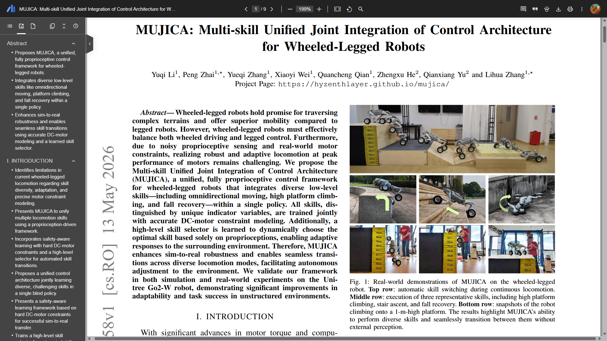
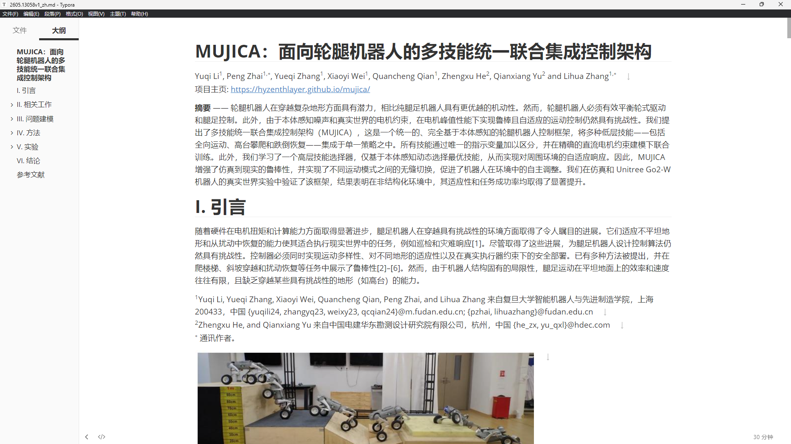

# Paper Translation Pipeline

学术论文 PDF → 中文 Markdown 的自动化翻译流水线。

## 快速开始

### 0. 获取 MinerU API Token

> 首次使用需要注册 MinerU 账号并获取 API Token，约 2 分钟。

1. 打开 https://mineru.net ，注册/登录账号
2. 登录后访问 https://mineru.net/apiManage/token ，创建并复制 JWT Token（格式为 `eyJ...` 开头的长字符串）
3. 将该 Token 设置为环境变量：

**Windows (Git Bash / WSL):**

```bash
export MINERU_TOKEN="你的JWT-Token"
```

新用户通常有免费额度，足够处理多篇论文。API 详细文档见：https://mineru.net/apiManage/docs

### 1. 提取 PDF

```bash
pip install requests
```

编辑 `extract_pdfs.py` 中的 `PDFS` 列表，添加你要解析的论文：

```python
PDFS = [
    {"path": "your_paper.pdf", "data_id": "paper1"},
]
```

然后运行：

```bash
python extract_pdfs.py
```

输出目录 `output_<论文名>/` 包含 `full.md` 和 `images/`。

### 2. 翻译

按照 `SKILL.md` 中的 5 阶段流程：

1. **准备** — 统计源文件行数和图片数，建立术语表
2. **规划** — 使用 Superpowers writing-plans skill 拆解任务
3. **执行** — 先翻短的论文积累术语，再翻长的；保留公式/图片/表格不变
4. **修复** — grep 对比图片数，补全遗漏内容
5. **验证** — 公式闭合检查、图片路径验证、术语一致性确认

### 3. 验证

```bash
# 图片数一致性
grep -c '!\[.*\](images/' output_*/full.md
grep -c '!\[.*\](output_' *_zh.md

# 公式闭合
grep -c '\$\$' *_zh.md
```

## 文件说明

| 文件 | 说明 |
|------|------|
| `skills/paper-translation/SKILL.md` | 完整翻译流程 skill |
| `skills/paper-translation/config.example` | Token 配置模板（复制为 `config` 后填入） |
| `extract_pdfs.py` | MinerU API 批量 PDF 提取脚本 |

## 关键规则

- **不改原文** — 输出使用 `_zh` 后缀
- **保留不变** — LaTeX `$$...$$`、图片 ``、表格、代码块、`<details>` 块
- **图片路径修正** — `images/xxx.jpg` → `output_<论文名>/images/xxx.jpg`
- **术语一致** — 多篇论文共享统一术语表

## 翻译效果

以 MUJICA 论文为例，左侧为原始 PDF，右侧为翻译后的中文 Markdown：

| 翻译前 | 翻译后 |
|--------|--------|
|  |  |

公式、表格、图片引用完整保留，正文准确翻译为学术中文。

## Token 消耗参考

以 MUJICA 论文（426 行, 9 张图）为例，完整翻译流程的 token 消耗：

> 别问为什么用这篇测，才不是想看到蓝色黄色绿色紫色黑色头发小女孩乐队，只是想学习Safe RL类的论文内容

```
  Context Usage
     ⛁ ⛁ ⛀ ⛀ ⛁ ⛁ ⛁ ⛁ ⛁ ⛁   deepseek-v4-pro[1M]
     ⛁ ⛁ ⛁ ⛁ ⛁ ⛁ ⛁ ⛶ ⛶ ⛶   66.4k/400k tokens (17%)
     ⛶ ⛶ ⛶ ⛶ ⛶ ⛶ ⛶ ⛶ ⛶ ⛶
     ⛶ ⛶ ⛶ ⛶ ⛶ ⛶ ⛶ ⛶ ⛶ ⛶   Estimated usage by category
     ⛶ ⛶ ⛶ ⛶ ⛶ ⛶ ⛶ ⛶ ⛶ ⛶   ⛁ System prompt: 6k tokens (1.5%)
     ⛶ ⛶ ⛶ ⛶ ⛶ ⛶ ⛶ ⛶ ⛶ ⛶   ⛁ System tools: 5.9k tokens (1.5%)
     ⛶ ⛶ ⛶ ⛶ ⛶ ⛶ ⛶ ⛶ ⛶ ⛶   ⛁ Custom agents: 1.3k tokens (0.3%)
     ⛶ ⛶ ⛶ ⛶ ⛶ ⛶ ⛶ ⛶ ⛶ ⛶   ⛁ Memory files: 101 tokens (0.0%)
     ⛶ ⛶ ⛶ ⛶ ⛶ ⛶ ⛶ ⛶ ⛶ ⛶   ⛁ Skills: 5.4k tokens (1.3%)
     ⛶ ⛶ ⛝ ⛝ ⛝ ⛝ ⛝ ⛝ ⛝ ⛝   ⛁ Messages: 47.8k tokens (11.9%)
                           ⛶ Free space: 300.6k (75.2%)
                           ⛝ Autocompact buffer: 33k tokens (8.3%)
```

| 阶段                   | 消耗（估算）          |
| ---------------------- | --------------------- |
| Pre-flight + 配置      | ~2k tokens            |
| PDF 提取（MinerU API） | ~1k tokens            |
| Plan 模式规划          | ~3k tokens            |
| 全文翻译（426 行）     | ~35k tokens           |
| 验证与修复             | ~5k tokens            |
| **合计**         | **~47k tokens** |

> 此数据使用 `deepseek-v4-pro[1M]` 模型在 `claude code` 测得。论文越长、图片越多，消耗越高。 视图命令： `/context`

## 作为 Claude Code Skill 使用

### 方式 1：npx skills add（推荐）

```bash
npx skills add APLaS/paper-translation
```

安装工具自动发现 `skills/paper-translation/SKILL.md`，无需手动操作。之后在 Claude Code 中直接说"翻译这篇论文"即可触发。

### 方式 2：手动安装

将 `skills/paper-translation/` 复制到 `~/.claude/skills/paper-translation/`，然后将 `config.example` 复制为 `config` 并填入 Token。

## 结语

梁圣牛逼，D神牛逼，写完skills并且翻译了三篇文章也就用了三块钱
